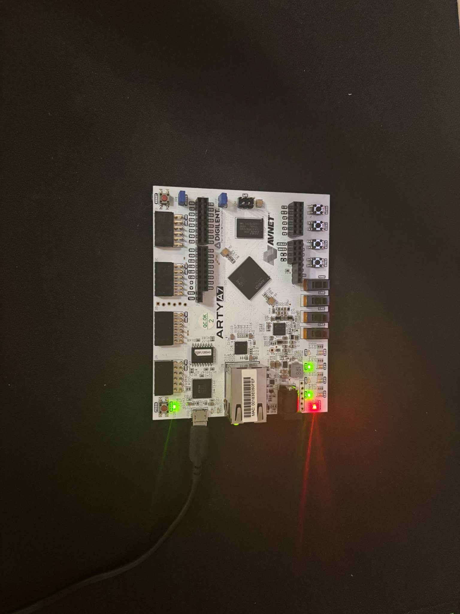

# Five-Stage RV32I CPU

**A custom SystemVerilog processor, verified in simulation and brought up on an Arty A7-100T FPGA.**

This project implements a 32-bit, five-stage RISC-V pipeline with operand forwarding, load-use stalls, and branch/jump flushing. The completed FPGA MVP executes a program from instruction ROM, computes `4 + 3 + 2 + 1`, and writes the result through memory-mapped GPIO to physical LEDs.

**Hardware result: `10` decimal → `LED3..LED0 = 1010`.**

<p align="center">
  
</p>

*Physical demonstration on the Arty A7-100T. The processor executes the loop and writes the LED register; the board wrapper connects GPIO bits to the LEDs.*

## At a glance

| Area | Implementation |
| --- | --- |
| RTL | SystemVerilog; custom 32-bit processor |
| Pipeline | IF → ID → EX → MEM → WB |
| Data hazards | EX/MEM and MEM/WB forwarding; load-use stall/bubble insertion |
| Control hazards | EX-stage branch/jump resolution; IF/ID and ID/EX flushing |
| Memory | Separate instruction ROM and data RAM; asynchronous reads |
| Peripheral | 32-bit GPIO register at `0x1000_0000`; low four bits drive LEDs |
| Verification | Self-checking unit, pipeline, control-flow, and FPGA-demo simulations |
| Hardware | Digilent Arty A7-100T / Artix-7; Vivado synthesis and deployment |
| Scope | Completed FPGA MVP implementing an RV32I subset, with LW/SW memory access |

## Architecture

```text
      IF             ID               EX              MEM           WB
  PC + IMEM → Decode + Regfile → ALU / Branches → RAM / GPIO → Writeback
      │          │                    ▲                              │
      └── stall / redirect            └── EX/MEM + MEM/WB forwarding ┘

  100 MHz board clock ──► top ──► rv32i_core
  BTN0 reset ───────────► top          │
                                      └── GPIO[3:0] ──► LEDs[3:0]
```

- **Forwarding:** EX/MEM takes priority over MEM/WB when both match a source register. Forwarded operands feed arithmetic, branch comparisons, JALR targets, and store data.
- **Load-use handling:** source-use qualifiers avoid false dependencies; a matching load stalls PC and IF/ID while inserting an ID/EX bubble.
- **Control-flow recovery:** taken branches and jumps redirect fetch and flush younger instructions. JAL/JALR write `PC + 4` to the destination register.
- **Register file:** 32 registers, hardwired x0, and same-cycle write-through behavior.

## FPGA demonstration

The committed [`program.hex`](program.hex) matches the image used in the working local Vivado project. Each line is one 32-bit instruction word for `$readmemh`, starting at address zero.

```asm
lui  x1, 0x10000       # GPIO address = 0x1000_0000
addi x2, x0, 4         # counter
addi x3, x0, 0         # accumulator
loop:
add  x3, x3, x2
addi x2, x2, -1
bne  x2, x0, loop
sw   x3, 0(x1)         # GPIO = 10; LEDs = 1010
done:
jal  x0, done
```

The program exercises dependent arithmetic, branch-operand forwarding, taken/not-taken loop control, store execution, and MMIO. BTN0 resets the CPU and clears GPIO; releasing it reruns the program.

### Memory map

| Address | Function |
| --- | --- |
| Instruction `0x0000_0000–0x0000_0FFF` | 1,024-word instruction memory; demo occupies the first eight words |
| Data `0x0000_0000–0x0000_0FFF` | 1,024-word data RAM |
| Data `0x1000_0000` | Read/write GPIO register; bits `[3:0]` drive LEDs |

The current RAM uses `addr[11:2]`; non-GPIO addresses alias into that array. Accesses must be word-aligned. There is no address-fault or misalignment exception handling.

## Repository layout

```text
rtl/                         Processor, memories, and FPGA wrapper
constraints/arty_a7_100t.xdc  Clock, BTN0, and LED pin assignments
program.hex                  Eight-instruction FPGA demo
tb/                         Self-checking SystemVerilog testbenches
scripts/run_tests.sh         Verilator regression runner
docs/images/fpga_demo.jpeg   Physical board demonstration
LICENSE                      MIT license
```

## Verification

| Testbench | Main checks |
| --- | --- |
| `tb_alu` | ALU operations, signed/unsigned comparisons, shifts, zero flag |
| `tb_decode` | Opcode classes, immediate generation, control/writeback selection |
| `tb_regfile` | x0 protection, reads/writes, same-cycle bypass |
| `tb_forwarding` | Both operand paths, mixed sources, EX/MEM priority, x0 exclusion |
| `tb_hazard` | Load-use dependencies, source-use filtering, stalls, redirect priority |
| `tb_dmem` | RAM reads/writes, read-disable behavior, GPIO readback/reset, RAM isolation |
| `tb_core` | Integrated arithmetic/load/store, forwarding, one load-use stall, branch/JAL recovery |
| `tb_control_flow` | Six branch conditions, forwarded JALR base, wrong-path suppression |
| `tb_fpga_demo` | Actual `program.hex` through `top`; GPIO = 10, LEDs = 1010, reset and rerun |

Run from the repository root with Verilator and a C++ build toolchain installed:

```sh
./scripts/run_tests.sh
```

Build and simulation logs are saved under `build/`. The runner requires a passing testbench message in addition to successful execution. Validated with Verilator 5.052 on September 16, 2026.

For Vivado behavioral simulation, add `rtl/*.sv`, the desired testbench, and `program.hex`. Set each testbench as the simulation top and run it separately. The integrated CPU tests populate their own instruction sequences; `tb_fpga_demo` uses the committed ROM image directly.

## Reproduce the hardware demo

1. Create a Vivado RTL project targeting the **Arty A7-100T**.
2. Add `rtl/*.sv` as design sources and select **`top`** as the synthesis top.
3. Add `constraints/arty_a7_100t.xdc` as the constraint file.
4. Add `program.hex` as a memory initialization file and ensure `$readmemh("program.hex", ...)` resolves during synthesis and simulation.
5. Run synthesis and implementation, inspect timing and implementation reports, and generate the bitstream.
6. Program the board through Vivado Hardware Manager. Press and release BTN0; the four user LEDs should settle to **1010**, in LED3-to-LED0 order.

The checked-in board wrapper, MMIO memory, core GPIO wiring, and constraints were synchronized from the working Vivado source project. The supplied XDC specifies a **100 MHz / 10 ns clock target**. Hardware operation is confirmed by the author; timing slack, achieved Fmax, utilization, CPI, and power are not published here. A clock constraint alone is not a measured performance result.

## Scope and next steps

This is a completed educational FPGA MVP, with explicit boundaries:

- Word loads/stores (`LW`, `SW`) are implemented. Byte/halfword accesses are future work.
- Full RV32I architectural compliance has not been established. Illegal-instruction traps, system instructions, and exception handling are not implemented.
- Memories use asynchronous reads; a synchronous BRAM implementation requires corresponding pipeline changes.
- The board button currently drives reset directly. Reset synchronization/debouncing is a future robustness improvement.
- Directed tests and the board demo establish specific behaviors; they do not constitute exhaustive or formal verification.

Next priorities are broader ISA validation, byte/halfword memory support, BRAM-backed memories, and published timing/resource/performance measurements.

## Author and license

Created by [Shane Bringhurst](https://github.com/shanebri). Licensed under the [MIT License](LICENSE).
